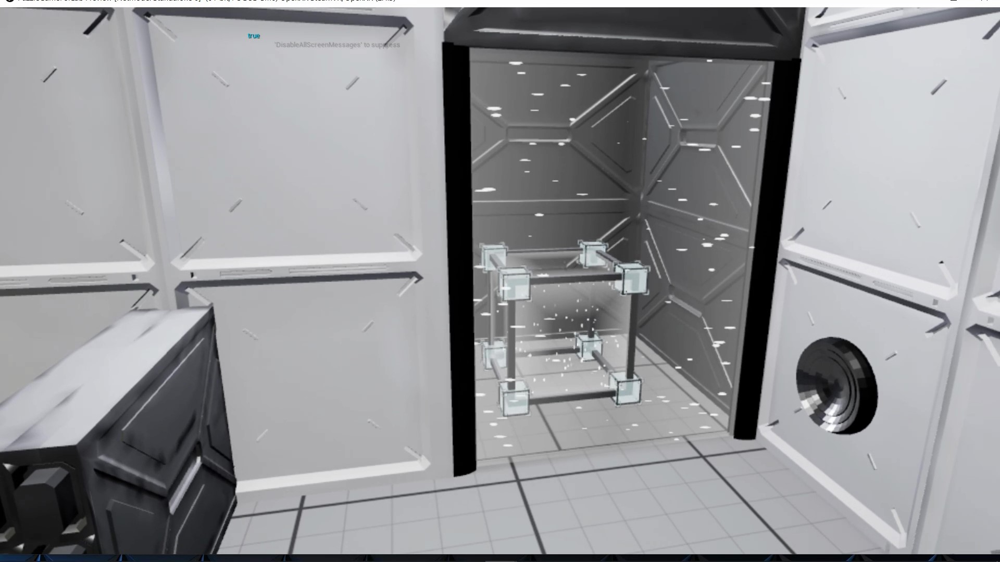
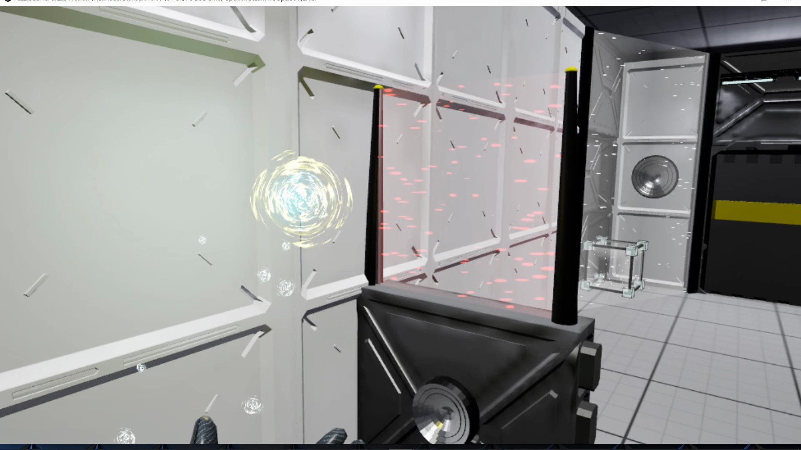
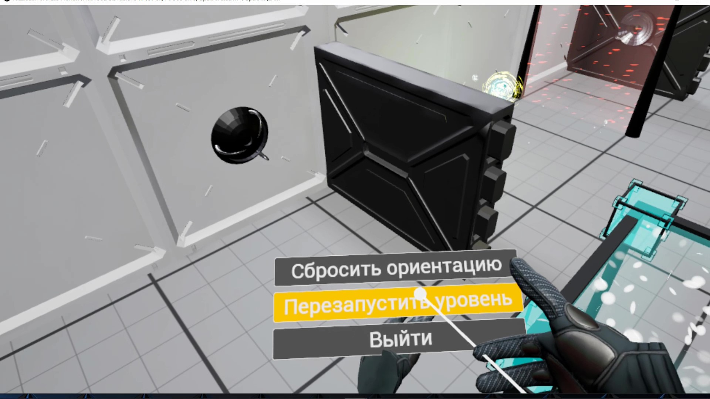
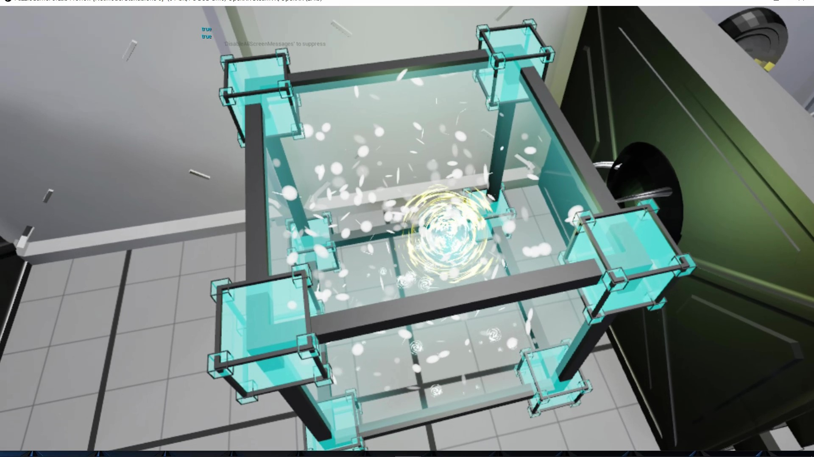
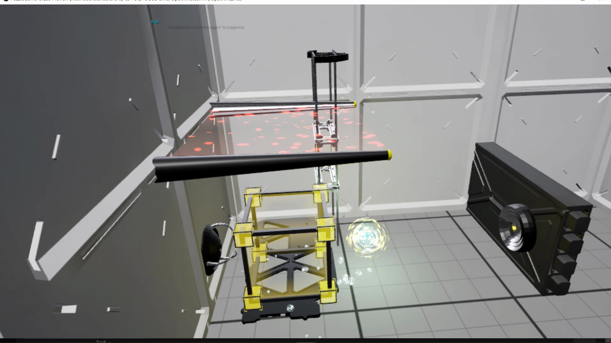

# PuzzleGameForLab
## Описание
Игра-головоломка в виртуальной реальности. Игроку предстоит решать головоломки, основанные на физических элементах.

Прогресс игрока сохраняется в пределах игровой сессии. Игрок всегда может перезапустить текущий уровень.

## Управление
- Отведение правого стика назад – телепортация
- Удержание боковой кнопки – удержание объекта в руках
- Отклонение левого стика влева или вправо – поворот на 45 градусов в соответсвующую сторону
- Нажатие кнопки "меню" на левом контроллере – открытие меню

## Демонстрационное видео

[Зеркало](https://drive.google.com/file/d/1iWzYitVexiZQOPvvuaZXOIhWPMl1CAmI/view?usp=drive_link)

## Скриншоты

## Запуск
### Игра
Для запуска игры достаточно скачать последний [билд](https://github.com/MrNightFury/PuzzleGameForLab/releases/download/Release/PuzzleGameForLab.zip) ([зеркало](https://drive.google.com/file/d/16qymZFRpYOwiS8UwR7GP9Nz8akFtPrXu/view?usp=drive_link)), распаковать архив и запустить ярлык "PuzzleGameForLab.exe".
Игра тестировалась на гарнитурах виртуальной реальности HTC Vive Cosmos и Oculus Quest 2 под OC Windows.

### Предпросмотр в редакторе
Для запуска проекта в редакторе требуется UnrealEngine версии 5.3.2.
- Склонируйте данный репозиторий
- Откройте файл проекта "PuzzleGameForLab.uproject"
- Дождитесь окончания загрузки редактора
- Т.к. файлы с запечёнными картами света не включены в репозиторий, для корректного отображения статического света выполните запечку (Build -> Build lighting only)
- Нажмите на кнопку "Simulate" или "VR Preview" в зависимости от желаемого типа запуска

## Авторство
Игра разработана Олегом MrNightFury Вохриным в качестве тестового задания отобора в RTU IT Lab по направлению UnrealEngine.

## Техническая реализация
Проект разработан с использованием движка Unreal Engine 5.3.2.

Логика приложения реализована с использованием Blueprints и рассчитана на лёгкую расширяемость и кастомизируемость.

Кастомные модели были созданы в Blender.

Для обработки звуков использовался Audacity.

Использовались ассеты, поставляемые вместе с движком.

Также в процессе разработки использовались сторонние ассеты:

## Использованные ассеты:
### Модели
- Large Scifi Lamp – https://sketchfab.com/3d-models/large-scifi-lamp-c6e99b55896a412dafd3239e06088423 | Attribution 4.0
- Sci-Fi walls Kitbash Pack_92+ Vol.7 – https://www.artstation.com/marketplace/p/1VvMK/sci-fi-walls-kitbash-pack-92-vol-7 | Extended Commercial License

### Звуки
- Electric Sparks.wav – https://freesound.org/people/kev_durr/sounds/396470/ | Creative Commons 0
- ELECBuzz_Electric hum and buzz with sparks.Designed_EM.wav – https://freesound.org/people/newlocknew/sounds/668965/ | Attribution NonCommercial 4.0
- Sfx door open – https://freesound.org/people/Paul368/sounds/264061/ | Creative Commons 0